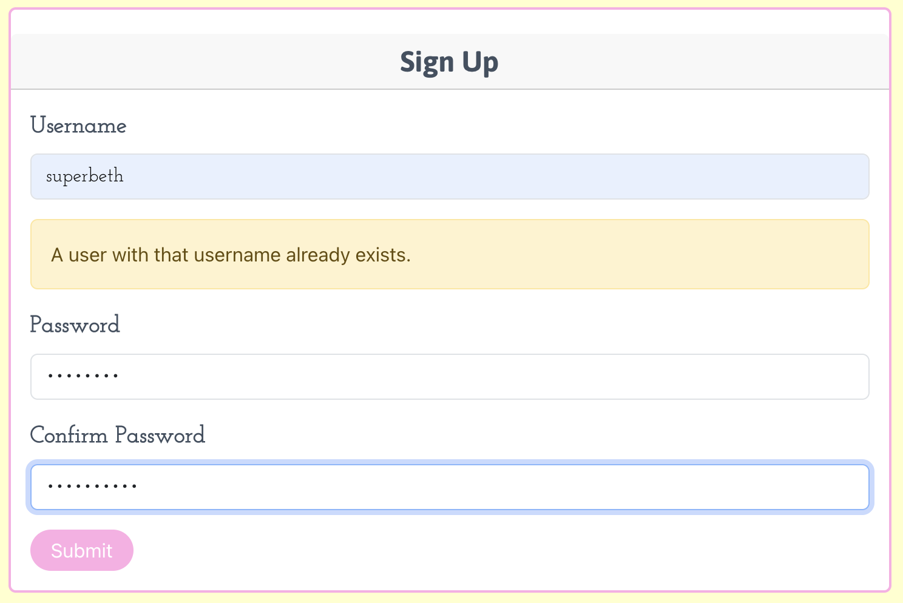
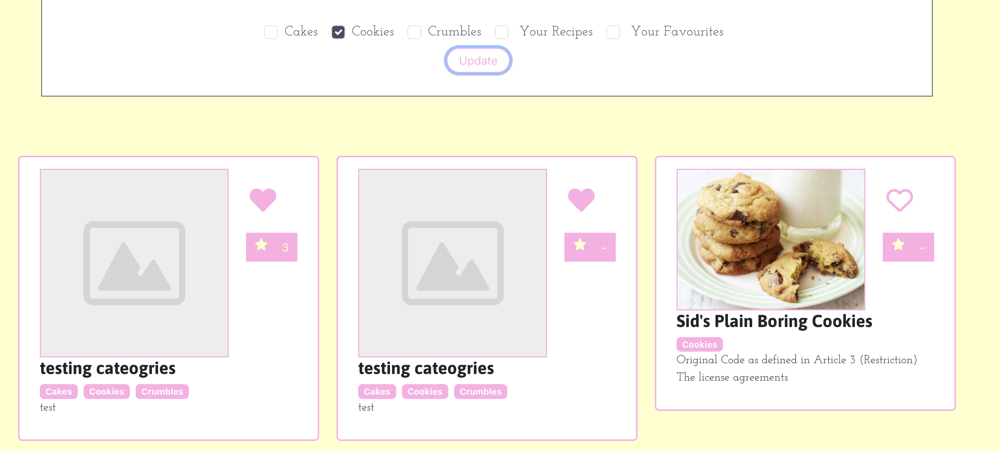

# Cakes, Cookies and Crumbles

Cakes, Cookies and Crumbles is a site where users can view and upload upload their recipes, specifically their cakes, cookies and crumbles. They can also view other people recipes, favouriting them if they wish to bake the recipe for themselves and can rate the recipe out of 5 stars. Users can filter recipes by category, favourites and their own recipes. The user can chose to edit and delete their own recipes if they wish. Overall, the site is a place for people to share their own tasty treats with other baking enthusiasts.

You can view Cakes, Cookies and Crumbles here (create your own recipe if you want!) > [Cakes, Cookies and Crumbles](https://bethieieio.github.io/CakesCookiesCrumbles/)

- If you want to see the docs for the backend? [IT'S HERE](https://cakes-cookies-crumbles-c12827854ad0.herokuapp.com/swagger/) 
> Swagger only works with debug on.

- If you want to read more, here is the backend README if you so wish. [HERE](https://github.com/Bethieieio/ccc-backend#readme)


## Contents

- [**Objective**](#objective)
- [**User Experience**](#user-experience) 
  - [Project Goals](#project-goals) 
  - [Components](#components) 
  - [Design Choices](#design-choices) 
  - [Project Management](#project-management) 
- [**Permissions**](#permissions)  
   - [Logged Out User](#logged-out-user) 
   - [Logged In User](#logged-in-user) 
- [**Features**](#features) 
   - [Current Features](#current-features) 
   - [Future Features](#future-features)
- [**Technologies Used**](#technologies-used)
- [**Testing**](#testing)
-[**Deployment to Heroku**](#deployment-to-heroku)

    

## Objective

Cakes, Cookies and Crumbles is my fifth and final project with [Code Institute](https://codeinstitute.net/).
I have to demonstrate my understanding of ReactJS front end and Django Rest framework for the backend and having to bare in mind a the focus on design, making sure the viewer has a positive user experience.
Using the Agile methodology is key to help break things own and to keep the project as organised as possible.
In Code Code Institutes words:

> In this project, you will design and build a content-sharing web application with React and an API (Django Rest Framework) Back-End. This will allow your users to browse and comment/ like each other's content as well as add, edit and delete their own.

## Development
When developing locally, use the below command to start the React app.
```
$ npm run start
```

## User Experience

### Project Goals

1. Give the ability for users to share their tasty snacks.
2. Have the site be responsive for every screen sizes.
3. Create a layout that is bright and related to the subject in hand for that positive user experience.
4. Have a filter system to allow users to find their baking category of choice.
5. The ability for users to favourite a recipe they love / wish to try.
6. User needs to be able to filter their favourite recipes to come back to them at a late date.
7. The user should be able to unfavourite a recipe too.
8. Create the ability of user feedback by creating a 5 star rating system.
9. The user needs to be able to create their own recipe easy by having to put ingredients, intructions and a desctiption in different fields. Including a way to add an image.
10. The user needs to be able to edit and delete a recipe of choice with ease.
11. To filter their own recipe from all the other users recipes.
12. Users should only be able create, favourite and rate a recipe if they have an account.

### User Stories

User Stories
- As an authenticated user:
  - I would like to be able to login 
  - I would like to be able to post a recipe
  - I would like to be able to upload a picture of my recipe.
  - I would like to be able to edit the recipe if need be.
  - I would like to be able to delete the recipe if I want to.
  - I would like to be able to filter the recipes so I can look at categories of my choice. 
  - I would like to view all my recipes on a profile page
  - I would like to be able to write a review on other user’s  recipes.
  - I would like to be able to rate other user’s recipes.
  - I would like to filter the recipes so I  can only see my recipes 
  - I would like to favorite recipes.
  - I would like to rate other people’s recipes.
- As an unauthenticated user
  - I would like to view recipes of users who have uploaded their recipes 
  - As a user, I would like to be able to sign up for the site.


[Back to top](#contents)

### Design Prototype (Wireframes)

For the project, I used [Adobe XD](https://helpx.adobe.com/uk/support/xd.html) to create the wireframes. Wireframes help give me an idea of what I want to see the site layout. before I start writing code and to help me think about database structure. One of the main reasons I used XD was because it is a free site. I did not fancy paying for [Balsamiq](https://balsamiq.com/wireframes/) the wireframe site I used last time. I used the 30 day trial in my previous project.
Some of the layout has changed since creating the wireframes eg: new page for sign up and log in.


[Back to top](#contents)

### Components

ReactJS makes it easy to reuse components throughout the application.
This is a flowchart to see the parent/child relationships of each component.


### Design Choices

#### Colour Scheme

I chose four colours with the help of [Coolors](https://coolors.co/ffffcc-ffade5-ffffff-425061).
The pink and yellow colours are bright and happy colours that I associate with cakes and baking. They both show up on eachother making the words standout and easy for the user to read. I also chose white and a grey to help break up the yellow and pink at times also making the website look professional.<br>


#### Typeography

I have two fonts for the site. One for titles and one for content.<br>
I chose Josefin Slab as its thin, delicate but still easy to read. It gives a nice contrast to the title font.
<br>
I chose Asap for the title for its round and bold apparence. It is easy to read and stands out without overpowering the smaller font.
<br>

### Project Management

I use Github Projects to create a kanban board to help plan and organise my project. <br>
https://github.com/users/Bethieieio/projects/3

[Back to top](#contents)

## Permissions

### Logged Out User

If the user does not have an account or they are logged out, they can see the following:

- View the homepage and all the recipe headers, account holders have created.
- See the average rating each recipe has on the homepage.
- Go into a single recipe and view all the instructions.
- Sign up page.
- Log in Page.

### Logged In User

A logged in user can view all of the content a logged out user can see but also can see / do the following.

- Favourite recipes
- Use of the favourites filter
- Create their own recipes
- Use of the 'Your Recipes' filter
- Edit their recipe
- Delete their recipe
- Rate recipes

## Features

### Current Features

#### Log In page
The user log in page allows users that have an account to create their own recipe and other features.
The user needs to input their username and password. An error appears if the user inputs the incorrect details.


#### Sign up
Before the user can sign in, they need to create an account.
An unique username needs to be chosen, followed by the user's chosen password and it's confirmation.
The username is unable to create an account of the same name as someone else or have a password that is too commom i.e: password.




#### Navigation Bar
For this site, the navigation bar is very simple.
For users that are not logged in, they will see links to the Sign Up and Login pages.
If the users are logged in, they will see "Create a Recipe" and Sign Out links. <br>
 <br>
<br>


#### Recipes on Home Page
On the homepage, it is full of the recipes headers. They contain the name of the recipe, the description and the image. It also contains the tag, the rating score and the favourite toggle button (if the user is logged in). If the user is logged in, on a recipe they have written, displays a pencil button that allows the user to edit the recipe if they wish. If the user is not logged in or they did not write the recipe, they will not see this button.<br>
<br>

#### Single Recipe
Once the user has clicked on the recipe, it takes them to it's main recipe page.
The title is at the top. With the favourite buttons and ratings button on either side.
In the main section, the image is on the top right, next to it are the recipe's ingredients. 
Below is the recipes description and the instructions.<br>
<br>

#### Favourites Toggle
The favourite toggle is in a shape of a heart. They are located on every recipe header and in the main recipe.
When the user is not logged in and click the heart, they are taken to the log in page, as the user cannot favourite a recipe if they are not logged in. If the user is logged in, it is added to their favourites. The user can view their favourites by using the filter bar. The heart symbol's colour is not filled in if the user has not liked the recipe. Once the user has liked the recipe, the hearts colour is filled in. <br>
 <br>
 <br>
 <br>

#### Rating
The user can rate a recipe by scoring it out of 5 stars on the main recipe page, by clicking on the star symbol. A model will pop up, once clicking the star the user think the recipe is worth.
The user can only rate a recipe if they are logged in.
If a unlogged in user tries to rate a recipe, they will get lead to the login page.
On the recipe header on the homepage, you can see the average rating the recipe has.<br>
<br>
<br>
<br>
<br>

#### Edit Recipe and Delete
If a logged in uploader wishes to edit their recipe, they can by going into the main recipe page and clicking on the pencil icon. They can only edit their own recipe. They can change anything from the title to the description. They can also change the image and the tags. Once in the editing screen, they can also delete the recipe if they so wish.
Once they click the button to do this, a modal will pop up confirming if they wish to delete the recipe.<br>
<br>
<br>
<br>
<br>

#### Categories & Filter Bar
A user can filter out recipes by catagory, favourites, users recipes.
They can choose as many options as possible, click update and then the page updates to the chosen options.
A logged in user has more options than a user that is not logged in. They can filter out their favourite recipes and thier own recipes.<br>
<br>
<br>
<br>


#### Future Features

If I get the chance again, I would like to add the following features to Cakes, Cookies and Crumbles.

- The ablity to comment on other peoples recipes. (Logged in User).
- To be able to view all of another users recipes on the same page.
- To filter recipes on the homepage by number of favourites and rating score.
- To have more images on one recipe.
- To have different categories such as vegan, gluten free, nut free etc and to have these as filters too.

[Back to top](#contents)
## Technologies Used

### Languages

- [JavaScript](https://en.wikipedia.org/wiki/JavaScript) the massive bulk of the frontend of this website is written in Javascript. It is a single page React Application.
- [HTML5](https://html.com/html5/) to layout and structure the websites content.
- [CSS](https://www.w3schools.com/css/) to help present the website to be cute and pretty yay

### Libraries and Frameworks

- [React](https://react.dev/) Javascript library for creating single page applications
- [Bootstrap](https://getbootstrap.com/) a CSS framework to use for quicker and easier way to make sites responive for any size screened device.
- [Font Awesome](https://fontawesome.com/) icons toolkit I used for the favourite hearts, rating stars and edit pencils.
- [Google Fonts](https://fonts.google.com/) I got the font famillies I used from Google Fonts, a massive open source font library.

### Packages and Dependences

- [Axios](https://axios-http.com/) HTTP client for making network requests.
- [React Bootstrap](https://react-bootstrap.github.io/) React components for using Bootstrap with React.
- [React Dom](https://legacy.reactjs.org/docs/react-dom.html) a react librbary for running react in the webpage
- [React Router Dom](https://www.npmjs.com/package/react-router-dom) enables routing and in app navigation.

### Other Tools
- [GitHub](https://github.com/) Version control, deploy and host front end, created project board and issues.
- [VS Code](https://code.visualstudio.com/) IDE. Where all my code is written.
- [Adobe](https://helpx.adobe.com/support/xd.html) Used to create wireframes.
- [Heroku](https://www.heroku.com/) Deploy and host backend.

[Back to top](#contents)
## Testing 

### Lighthouse Testing
I am over all happy with the results for the Lighthouse Testing. I would one day like to imopve the Performance one by figuring out how to have a restriction for image sizes uploaded to the site.

- Home Page
<br>

- Log in
<br>

- Sign Up 
<br>

- Single Recipe Page
<br>

- Edit Recipe
<br>

- Create A Recipe
<br>

### Manual Testing

- Implementation : Username must be unique.
- Expectation : If the user attempts to sign up with a username that already exists, they will recieve a validation error.
- Test : I tried to sign up with a username that already exists.
-  Result :  The validation error was present when I attempted a duplicate username entry. The test was successful.


- Implementation : Password needs to be uncommon 
- Expectation : If the user tries to sign up using a password that is too common ie : 'password' or simialar to the username, they will recieve a validation error.
- Test : I tried to sign up with the password as 'password'.
- Result : The validation error was present when I attempted a common password entry. The test was successful.


- Implementation : Sucessful sign in, navigate to homepage.
- Expectation : When the user is logged into their account, they should be directed to the homepage.
- Test : I logged into my account with the correct credentials.
- Result : The site directed me to the homepage when I logged in correctly. The test was successful.


- Implementation : Logging in with incorrect credentials.
- Expectation : If the user either the wrong username and password combination, they should recieve a validation error.
- Test : I attempted to log in with an incorrect password. I then to log in with an incorrect username.
- Result : The validation error was present when I attempted to log in with the incorrect credentials. The test was successful.


- Implementation : Cannot create a recipe with invalid fields
- Expectation : If any of the form fields are left blank, validation errors will appear on the ones that are blank.
- Test : To try and submit an empty recipe.
- Result : The validation error was present when I attempted to create an empty recipe. The test was successful


- Implementation : To sucessfully create a recipe.
- Expectation : The recipe should be submitted successfully and then the user should be directed to the homepage with their new recipe on the top left corner of the page.
- Test : I created a recipe with an image of myself. 
- Result : The recipe was submitted with no faults. I was directed back to the homepage with my recipe in view.


- Implementation : To prevent a user from editing another users recipe.
- Expectation : The user should not be allowed to edit any recipe other than their own. 
- Test : I attempted to navigate to an edit recipe page on a recipe that I did not own.
- Result : I was navigated away from the page. The only way to edit a recipe is to own it. Seeing pencil icon on a recipe on the homepage indicates that the recipe is yours and that it can be edited by you.
> Navaigation happened too quick to take a screenshot.


- Implementation : To delete a recipe.
- Expectation : For the user to be able to remove a recipe.
- Test : To delete a recipe that I have written.
- Result : I clicked on the delete recipe button. A pop up appreared asking me if I definitely wanted to delete recipe. I clicked 'yes'. I was this directed to the homepage with my recipe no longer on the homepage.


- Implementation : To return a paginated list of recipes.
- Expectation : To receive the first ten recipes. 
- Test : I navigated to the homepage and waited for the first ten to appear.
- Result : The lastest ten recipes were shown.


- Implementation : To load the next page when using the "see more recipes" button.
- Expectation : More recipes will be fetched from the server and be shown to the user.
- Test : T0 click the "see more recipes button".
- Result : Older recipes showed up to the UI when I clicked the button.


- Implementation : Filtering recipes by their categories.
- Expectation : When the user clicks on one of the 5 filter categories (5 when user is logged in, 3 if the user is not logged in), the recipes should filter to only the recipes of that chosen category.
- Test : I logged in, then I chose the 'Cookie' category and clicked the 'Update' button below. I then made sure all the other categories worked as well.
- Result : The recipes with the cookie category were the only ones that appeared on the page. All the other categories worked as they should. This test was sucessful.


- Implementation : Viewing my the users recipes, that that have written.
- Expectation : When the user is logged in, they have a filter where they can see their own recipes that they have created.
- Test : I used the 'Your Recipes' fitler on the filter bar at the top of the page. To see if my recipes are filtered out from the restof the other recipes.
- Result : The recipes that I created were filtered from the all the rest. In the picture below, you can see that they are my recipes as the edit button is shown on the recipe box.


- Implementation : Filtering more than one category at once.
- Expectation : If the user selects more than once category, then both categories will be shown on the homepage
- Test : I selected two categorie, updated the page and they both displayed.
- Result : All recipes with the chosen categories appeared on the paginated list.


[Back to top](#contents)

## Deployment to Heroku 
1. First, I clone the repository from GitHub.
<br>
2. Then I copied the SSH link.
<br>
3. I then used the git clone command to clone to my local machine.
<br>


This is how I deployed the backend of this site to Heroku
4. I Created a new app on Heroku
<br>
5. I gave the app a unique name and chosen the region where I am from.
<br>
6. I then linked my Github backend repository to Heroku.
<br>
7. I then inputted all the necessary config vars to Heroku.
<br>
8. I input the Python buildback.
<br>
9. I created the Procfile that so Heroku knows what profile to run? 
<br>
10. I chosen to deploy the main branch.
<br>
11. I added the Heroku app host to my origins for CORS.
<br>

